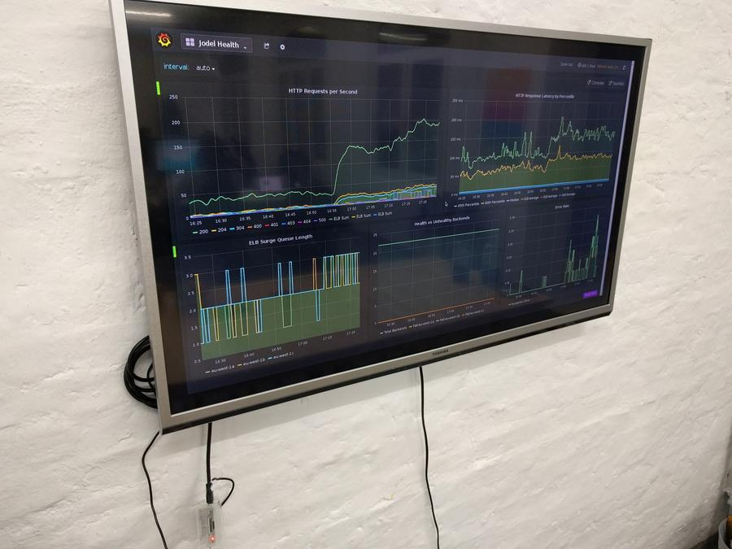

# The Jodel Dashboard Viewer
This [resin.io](https://resin.io/) based application runs on a raspberry pi to
display our [grafana](http://grafana.org/) dashboards (powered by
http://prometheus.io/).

It's running firefox with the [R-kiosk](https://addons.mozilla.org/en-us/firefox/addon/r-kiosk/)
extensions. Optionally it runs an openvpn client in case your dashboards are
not accessible from the public internet.

## Use it
Add your resin git remote and push the project. For details see
[resin.io's getting started documentation](http://docs.resin.io/#/pages/installing/gettingStarted.md).

Just clone this repo instead of the example.
After that, you need to set some [environment variables](http://docs.resin.io/#/pages/management/env-vars.md):

- `URL`: Dashboard URL to open
- `PASS`: The dashboard runs dropbear, this var will be the root password. If unset, defaults to 'root'

To use openvpn, set the following options:

- `REMOTE_HOST`: Address of openvpn server
- `REMOTE_PORT`: Port the openvpn server is running on
- `VPN_USER`: VPN Username
- `VPN_PASS`: VPN Password
- `CERT`: Client certificate, newlines replaced by `\n`

## Limitations
Especially the openvpn config is a bit specific to user setup, for example it
uses TCP. It's not a priority for us to make it more generic, but PRs for that
are welcome.
